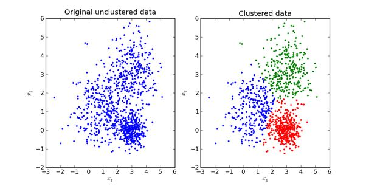

[toc]
# 高斯混合模型(GMM)

## 1. 混合模型( Mixture Model）

混合模型是一个可以用来表示在总体分布（distribution）中含有 $K$ 个子分布的概率模型，换句话说，混合模型表示了观测数据在总体中的概率分布，它是一个由 $K$ 个子分布组成的混合分布。混合模型不要求观测数据提供关于子分布的信息，来计算观测数据在总体分布中的概率。
## 2. 单斯混合模型
当样本数据 X 是一维数据（Univariate）时，高斯分布遵从下方概率密度函数（Probability Density Function）：
$$
\begin{aligned}
    P(x|\theta) = \frac{1}{\sqrt{2 \pi \theta^2}}{\mathrm{exp}(-\frac{(x-\mu)^2}{2\sigma^2})}
\end{aligned}
$$

其中 $\mu$ 为数据均值（期望）， $\sigma$ 为数据标准差（Standard deviation）。

当样本数据 $X$ 是多维数据（Multivariate），维度为 $D$, 高斯分布遵从下方概率密度函数：
$$
\begin{aligned}
    P(x|\theta) = \frac{1}{(2\pi)^{\frac{D}{2}} |\Sigma| ^{\frac{1}{2}}} \mathrm{exp}(-\frac{(x-\mu)^T \Sigma^{-1}(x-\mu)}{2})
\end{aligned}
$$

其中， $\mu=\{\mu^{(1)},, \mu^{(2)} \cdots, \mu^{(D)} \}$ 为数据均值（期望）， $\Sigma$ 为协方差（Covariance），$D$ 为数据维度。协方差矩阵如下：
$$
\begin{aligned}
    \Sigma =\begin{bmatrix} \sigma _{ 1 }^{ 2 } & \sigma _{ 1 }\sigma _{ 2 } & \cdots  & \sigma _{ 1 }\sigma _{ D } \\\\
    \\
     \sigma _{ 2 }\sigma _{ 1 } & \sigma _{ 2 }^{ 2 } & \cdots  & \sigma _{ 2 }\sigma _{ D } \\\\ 
     \\
     \vdots  &  \cdots &  \cdots & \cdots \\\\
     \\
     \sigma _{ D }\sigma _{ 1}  &\sigma _{ D} \sigma _{ 2 } &  \cdots & \sigma _{ D }^{2} \end{bmatrix}
\end{aligned}
$$
## 3. 高斯混合模型
高斯混合模型可以看作是由 $K$ 个单高斯模型组合而成的模型，这 $K$ 个子模型是混合模型的隐变量（Hidden variable）。一般来说，一个混合模型可以使用任何概率分布，这里使用高斯混合模型是因为高斯分布具备很好的数学性质以及良好的计算性能。

举个不是特别稳妥的例子，比如我们现在有一组狗的样本数据，不同种类的狗，体型、颜色、长相各不相同，但都属于狗这个种类，此时单高斯模型可能不能很好的来描述这个分布，因为样本数据分布并不是一个单一的椭圆，所以用混合高斯分布可以更好的描述这个问题，如下图所示：

首先定义如下信息：

- $x_j$ 表示第 $j$ 个观测数据， $j=1,2,...,N$
- $K$ 是混合模型中子高斯模型的数量， $k=1,2,...,K$
- $\alpha_k$ 是所有的观测数据属于第 $k$ 个子模型的概率，相当于第 $k$ 个模型的先验概率，$\alpha_k \gt 0$， $\sum_{k=1}^{K}{\alpha_k = 1}$
- $\phi(x|\theta_k)$ 是第 $k$ 个子模型的高斯分布密度函数， $\theta_k = (\mu_k, \theta_{k}^{2})$ 。其展开形式与上面介绍的单高斯模型相同
- $\gamma_{jk}$ 表示第 $j$ 个观测数据属于第 $k$ 个子模型的概率，这个样本点$x_j$是有第$k$个模型产生:

高斯混合模型的概率分布为：
$$
\begin{aligned}
    P(x|\theta) = \sum_{k=1}^{K}{\alpha_k \phi(x|\theta_k)}
\end{aligned}
$$

对于这个模型而言，参数 $\theta = (\tilde{\mu_k}, \tilde{\sigma_k^2}, \tilde{\alpha_k})$ ，也就是每个子模型的期望、方差（或协方差）、在混合模型中发生的概率。
## 4. 模型参数学习
### 4.1 单高斯模型
单高斯模型可以选择使用极大似然估计(Maximum likelihood)，估计参数 $\theta$ 的值
$$
\theta =  \underset{\theta}{\mathrm{argmax}}{L(\theta)}
$$
这里我们假设每个数据点都是独立的(Independent)，似然函数有概率密度函数(PDF) 给出
$$
\begin{aligned}
    L(\theta) = \prod_{j=1}^{N}{P(x_j | \theta)}
\end{aligned}
$$

由于每个点发生的概率都很小，乘积会变得极其小，不利于计算和观察，因此通常我们用 Maximum Log-Likelihood 来计算（因为 `Log` 函数具备单调性，不会改变极值的位置，同时在 `0-1` 之间输入值很小的变化可以引起输出值相对较大的变动）：
$$
\begin{aligned}
    \mathrm{log}L(\theta) = \sum_{j=1}^{N}{\mathrm{P(x_j | \theta)}}
\end{aligned}
$$

### 4.2 高斯混合模型
* **对于高斯混合模型**，Log-Likelihood 函数是：
$$
\mathrm{log}L(\theta) = \sum_{j}^{N}{\mathrm{log}P(x_j|\theta)} = \sum_{j}^{N}{\mathrm{log}{\sum_{k=1}^{K}{\alpha_k \phi(x|\theta_k)}}} 
$$
如何计算高斯混合模型的参数呢？这里我们无法像单高斯模型那样使用最大似然法来求导求得使 likelihood 最大的参数，因为对于每个观测数据点来说，事先并不知道它是属于哪个子分布的（hidden variable），因此 log 里面还有求和，对于每个子模型都有未知的 $\theta = (\tilde{\mu_k}, \tilde{\sigma_k^2}, \tilde{\alpha_k})$ ，直接求导无法计算。需要通过迭代的方法求解。

* EM 算法
EM 算法是一种迭代算法，1977 年由 Dempster 等人总结提出，用于含有隐变量（Hidden variable）的概率模型参数的最大似然估计。每次迭代包含两个步骤：
  * E-step：求期望 $E(\gamma_{jk})$ for all $j=1,2,...,N$
  * M-step：求极大，计算新一轮迭代的模型参数

这里不具体介绍一般性的 EM 算法（通过 Jensen 不等式得出似然函数的下界 Lower bound，通过极大化下界做到极大化似然函数），只介绍怎么在高斯混合模型里应用从来推算出模型参数。

通过 EM 迭代更新高斯混合模型参数的方法（我们有样本数据 $x_1, x_2, ..., x_N$ 和一个有 $K$ 个子模型的高斯混合模型，想要推算出这个高斯混合模型的最佳参数）：

* 首先初始化参数
E-step：依据当前参数，计算每个数据 $x_j$ 来自子模型 $k$ 的可能性

$$
\begin{aligned}
    & \hat{ \gamma}_{jk} = \frac{\alpha_k \phi(x_j|\theta_k)}{\sum_{k=1}^{K}{\alpha_k \phi(x_j | \theta_k)}}, \qquad j = 1, 2, ..., N; k = 1, 2, ..., K \\
    & n_k = \sum_{j=1}^{N}{\hat{\gamma}_{jk}}
\end{aligned}
$$

- M-step：计算新一轮迭代的模型参数
  $$
  \begin{aligned}
      & \mu_k = \frac{\sum_{j=1}^{N}{\hat{\gamma}_{jk} x_j}}{n_k}= \frac{ \sum_{j=1}^{N}{\hat{ \gamma}_{jk}x_j} }{ \sum_{j=1}^{N}{\hat{\gamma}_{jk}}}, k=1, 2, ..., K \\
      \\
      & \Sigma_{k} = \frac{\sum_{j=1}^{N}{\hat{ \gamma}_{jk}(x_j - \mu_k)(x_j - \mu_k)^{T}}}{\sum_{j=1}^{N}{\hat{ \gamma}_{jk}}}, k=1, 2, ..., K(用这一轮更新后的) \\
      \\
      & \alpha_k = \frac{n_k}{N}= \frac{\sum_{j=1}^{N}{\hat{ \gamma}_{jk}}}{N}, k=1, 2, ..., K
  \end{aligned}
  $$

- 重复计算 E-step 和 M-step 直至收敛 （ $\left\| \theta _{ i+1 }-\theta _{ i } \right\| \le \varepsilon$ , $\varepsilon$ 是一个很小的正数，表示经过一次迭代之后参数变化非常小）
至此，我们就找到了高斯混合模型的参数。需要注意的是，EM 算法具备收敛性，但并不保证找到全局最大值，有可能找到局部最大值。解决方法是初始化几次不同的参数进行迭代，取结果最好的那次。

## 5. 代码实现
### 5.1 DiagGMM
在实际的开发中，通常会使用对角协方差矩阵的高斯混合模型，主要的原因如下：
1. 计算方便，计算量小
2. 可以通过提高高斯分量的数目去拟合全协方差矩阵的高斯混合模型

对角协方差高斯混合模型需要计算的参数如下：
- 权重/先验概率 $\alpha$
  $$
  \begin{aligned}
      \alpha = (\alpha_1, \alpha_2, ..., \alpha_K)
  \end{aligned}
  $$
- 均值 $\mu$
  $$
  \begin{aligned}
      \mu & =(\mu _{ 1 }^{ T },\mu _{ 2 }^{ T },...,\mu _{ K }^{ T })^{ T }\\\\
    & =\begin{bmatrix} \mu _{ 1 }^{ (1) } & \mu _{ 1 }^{ (2) } & \cdots  & \mu _{ 1 }^{ (D) } \\\\
     \mu _{ 2 }^{ (1) } & \mu _{ 2 }^{ (2) } & \cdots  & \mu _{ 2 }^{ (D) } \\\\
      \vdots  & \vdots  & \ddots  & \vdots  \\\\
        \mu _{ K }^{ (1) } &  \mu _{ K }^{ (2) } & \cdots &   \mu _{ K}^{ (D) }\end{bmatrix} ^{T}
  \end{aligned}
  $$
- 协方差矩阵
   单高斯协方差矩阵如下：
  $$
  \begin{aligned}
      \Sigma_i =\begin{bmatrix} \sigma _{ i1 }^{ 2 } & \cdots  & 0 \\ \vdots  & \ddots  & \vdots  \\ 0 & \cdots  & \sigma _{ iD }^{ 2 } \end{bmatrix}
  \end{aligned}
  $$
  在上述的协方差矩阵中，只有对角线上有值，因此只需要保存对角线上的 $D$ 个数据。因此在代码中保存高斯混合模型的所有高斯分量协方差矩阵可以用一个矩阵，如下所示：
  $$
  \begin{aligned}
      \Sigma =\begin{bmatrix} \sigma _{ 11 }^{ 2 } & \cdots  & \sigma _{ 1D }^{ 2 } \\ \vdots  & \ddots  & \vdots  \\ \sigma _{ K1 }^{ 2 } & \cdots  & \sigma _{ KD }^{ 2 } \end{bmatrix}      
  \end{aligned}
  $$

### 5.2 优化计算
- 动机：计算样本单个高斯分量的概率密度函数值，需要的计算量比较大，所以需要相关的优化以降低似然概率的计算量。
- 单个多维高斯分量的概率密度函数如下所示：
  $$
    \begin{aligned}
        P(x|\theta) = \frac{\alpha}{(2\pi)^{\frac{D}{2}} |\Sigma| ^{\frac{1}{2}}} \mathrm{exp}(-\frac{(x-\mu)^T \Sigma^{-1}(x-\mu)}{2})
    \end{aligned}
  $$
其中 $\alpha$ 是每个 GMM 分量的权重。
- 降低计算量对高斯分布取对数，得到对数高斯分布概率密度函数：
$$
\begin{aligned}
   \mathrm{log} P(x|\theta) & = \mathrm{log}{\alpha} -\frac{D}{2}{\mathrm{log}{2\pi}} - \frac{1}{2}{\mathrm{log{|\Sigma|}}} -\frac{(x-\mu)^T \Sigma^{-1}(x-\mu)}{2} \\
   \\
   & = \mathrm{log{\alpha}} - \frac{D}{2}{\mathrm{log}{2\pi}} - \frac{1}{2} \sum_{j=1}^{D} { \mathrm{log} \sigma_{j}^{2}} - \frac{1}{2} {(x^T \Sigma^{-1}x - 2 \mu^{T} \Sigma^{-1}x + \mu^{T}\Sigma^{-1}\mu  )}  \\
   \\
   & = \mathrm{log}{\alpha} - \frac{D}{2} \mathrm{log}{2\pi} - \frac{1}{2} \sum_{j=1}^{D}{\mathrm{log} \sigma_{j}^{2}} - \frac{1}{2}{\mu^T \Sigma^{-1} \mu} - \frac{1}{2}{{x^T \Sigma^{-1} x} } -  \mu^T \Sigma^{-1} x \\
   \\
   & = \left( \mathrm{log}\alpha - \frac{D}{2} \mathrm{log}{2\pi} - \frac{1}{2}{\sum_{j=1}^{D}{\mathrm{log} \sigma_{j}^{2} } } -\frac{1}{2} \sum_{j=1}^{D}{\frac{\mu_{j}^{2}}{\sigma_{j}^{2}}}  \right) -  \frac{1}{2}\sum_{j=1}^{D}\frac{x_{j}^{2}}{\sigma_{j}^{2}} + \sum_{j=1}^{D} \frac{x_j \mu_j}{\sigma_{j}^{2}} \\
   \\
   & = \mathrm {const} - \frac{1}{2}\sum_{j=1}^{D}\frac{x_{j}^{2}}{\sigma_{j}^{2}} + \sum_{j=1}^{D} \frac{x_j \mu_j}{\sigma_{j}^{2}}
  \end{aligned}
$$
​                其中 $\mathrm{const}$ 的定义如下：
$$
\begin{aligned}
      \mathrm{const} = \mathrm{log}{\alpha} - \frac{D}{2} \mathrm{log}2 \pi
  \end{aligned}
$$

* 代码实现

  在kaldi的系统中，没有存储每个维度方差，而是存储每个维度**方差的倒数$\frac{1}{\sigma_{j}^{2}} $**，以及方差倒数与均值的乘积 $\frac{\mu_j}{\sigma_{j}^{2}}$，因此上述的公式可以修改为如下的形式：
  $$
  \begin{aligned}
      \mathrm{const} = \mathrm{log} \alpha - \frac{D}{2} \mathrm{log} 2\pi + \frac{1}{2} \sum_{j=1}^{D} {\mathrm{log} \frac{1}{\sigma_{j}^{2}}} - \frac{1}{2} \frac{1}{1/{\sigma_{j}^{2}}} \sum_{j=1}^{D} {(\frac{\mu_{j}}{\sigma_{j}^{2}})^{2} }
  \end{aligned}
  $$

  所以最后的概率：
  $$
  \begin{aligned}
    P(x) = \mathrm{const} - \frac{1}{2} \mathrm{\_inv\_var} \bullet x^2 + \mathrm{\_means\_invars} \bullet x 
  \end{aligned}
  $$
  
## 参考

1. http://dingby.site/2018/06/08/%E9%AB%98%E6%96%AF%E6%B7%B7%E5%90%88%E6%A8%A1%E5%9E%8B(GMM)/
2. https://en.wikipedia.org/wiki/Mixture_model#Gaussian_mixture_model
3. https://github.com/ctgk/PRML
4. https://zhuanlan.zhihu.com/p/30483076
